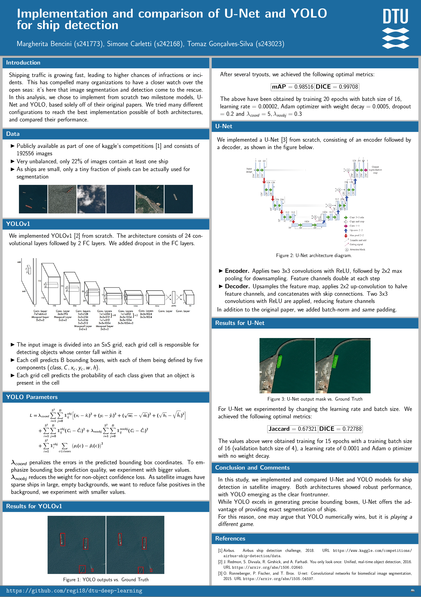
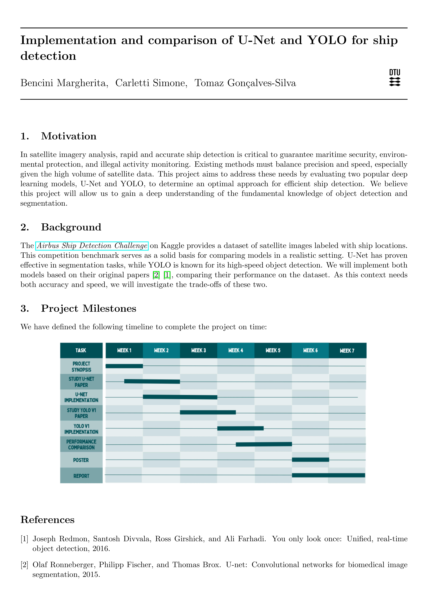

# Final project for Deep Learning (02456)

Comparison and implementation (from scratch) of YOLOv1 and U-Net.

Dataset: [Airbus Ship Detection Challenge](https://www.kaggle.com/competitions/airbus-ship-detection/)


# Poster




# Useful tips

We're training on the DTU HPC LSF 10 Cluster. All used scripts are available under `jobscripts/`.

### How to submit a job

From the **root of the repo** run, e.g.

```bash
bsub < ./jobscripts/unet/jobscript_train.sh
```

Then you can use `bstat` to check the job status.


### How to see real-time output

You can use `tail` to see the job log in real time, e.g.:

```bash
tail gpu_23113941.out -f
```

### tqdm output interpretation

```
Epoch 3, lr 0.0001:  18%|█▊        | 7376/40432 [02:56<13:06, 42.02it/s, loss=0.01581]
```

- `02:56`: This indicates the elapsed time since the progress bar started. In this case, no significant time has elapsed since the start of the epoch.
- `13:06`: This shows the estimated remaining time to complete the current epoch or task at the current processing speed.
- `42.02it/s`: This represents the processing speed, indicating that your model is processing 42.02 iterations (samples) per second.


### Evaluate on interactive GPU

To just evaluate the model you can use the interactive nodes.

Type:
```sh
# Enter an interactive node (alt: sxm2sh, voltash)
a100sh                         

cd ~/deep-learning-project
clear && ./jobscripts/unet/jobscript_evaluate.sh
```


<br>

# Synopsis


